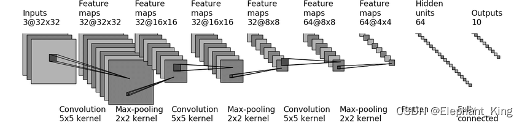

# CIFAR10Model
本项目将手动搭建训练CIFAR10数据集的神经网络

并且使用gpu进行训练

# 项目配置
本人使用的是MacBook Air M1芯片，所以在使用GPU训练前会有些许不同
1. 安装python
2. 安装python的anaconda用于对包进行管理
3. 安装pytorch以及torchvision
4. 在pycharm中配置项目的运行环境为conda的环境
5. 在终端激活自己的pytorch环境
6. 调用mac的gpu进行训练

前五步在此不多赘述，对于如何调用mac的gpu训练可以参考[【Pytorch】【MacOS】14.m1芯片使用mps进行深度模型训练](https://blog.csdn.net/Elephant_King/article/details/139012903?spm=1001.2014.3001.5502)

环境安装好后就可以愉快的进行训练了

如想学习具体的操作细节可以看本人的同步博客教程[从零学习CIFAR10的搭建教程](https://blog.csdn.net/elephant_king/category_12663257.html)

具体的学习是参考了b站小土堆的视频[PyTorch深度学习快速入门教程（绝对通俗易懂！）【小土堆】](https://www.bilibili.com/video/BV1hE411t7RN?p=31&vd_source=15ed5d8c9e322c2225db86171fe5bc49)

也希望大家能去支持原作者

如果有帮助希望能点个star
